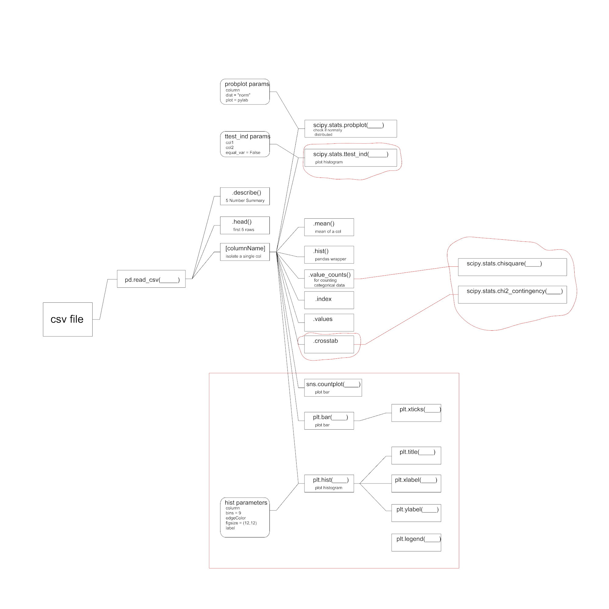

# [The 5-Day Data Challenge](https://www.kaggle.com/rtatman/the-5-day-data-challenge)

Rachael Tatman from Kaggle has been organizing 5-day data challenges from time to time, and they usually revolve around a particular theme in data. This first 5-day challenge is a bit introductory and meant to showcase workflow in python (and R) for performing certain data-oriented tasks. This notebook will follow along with the notebooks she posted, and I'm intending to vary it a bit to include other datasets and answer particular questions there. I'm also interested in brushing up on topics such as ttests and chi-squared tests. 

## Challenges

I won't upload the datasets in this repo, but you can find the them in the links below.

| Item | Dataset | Completed| Varied from original |
| --- | ---: | :---: | --- |
| [Day 1: Reading data into a kernel](https://www.kaggle.com/rtatman/5-day-data-challenge-day-1-python)|[Groundhog Day Forecasts and Temperatures](https://www.kaggle.com/rtatman/5-day-data-challenge-day-1-python/data)|✅||
| [Day 2: Plot a Numeric Variable with a Histogram](https://www.kaggle.com/rtatman/5-day-data-challenge-day-2-python)|[Nutrition facts for Starbucks Menu](https://www.kaggle.com/rtatman/5-day-data-challenge-day-2-python/data)|✅||
| [Day 3: Perform a t-test](https://www.kaggle.com/rtatman/5-day-data-challenge-day-3-python)|[80 Cereals](https://www.kaggle.com/rtatman/5-day-data-challenge-day-3-python/data)|✅||
| [Day 4: Visualize categorical data with a bar chart](https://www.kaggle.com/rtatman/5-day-data-challenge-day-4-python)|[5-Day Data Challenge Sign-Up Survey Responses](https://www.kaggle.com/rtatman/5-day-data-challenge-day-4-python/data)|✅||
| [Day 5: Using a Chi-Square Test](https://www.kaggle.com/rtatman/5-day-data-challenge-day-5-python)|[5-Day Data Challenge Sign-Up Survey Responses](https://www.kaggle.com/rtatman/5-day-data-challenge-day-5-python/data)|✅||
Rachael Tatman from Kaggle has been organizing 5-day data challenges from time to time, and they usually revolve around a particular theme in data. This first 5-day challenge is a bit introductory and meant to showcase workflow in python (and R) for performing certain data-oriented tasks. This notebook will follow along with the notebooks she posted, and I'm intending to vary it a bit to include other datasets and answer particular questions there. I'm also interested in brushing up on topics such as ttests and chi-squared tests. 

## Diagram
I thought it would be best to include a visual documentation of useful functions gained from this challenge for reference. I've highlighted certain things I would like to revisit in the future.

## Useful video references
* [x] [ttests from Bozeman Science](https://www.youtube.com/watch?v=pTmLQvMM-1M&t=311s)
* [x] [ttests from StatsCast](https://www.youtube.com/watch?v=0Pd3dc1GcHc)
* [x] [chi-square test from Bozeman Science](https://www.youtube.com/watch?v=WXPBoFDqNVk)
* [ ] [chi-square-test from Khan Academy](https://www.youtube.com/watch?v=2QeDRsxSF9M)
